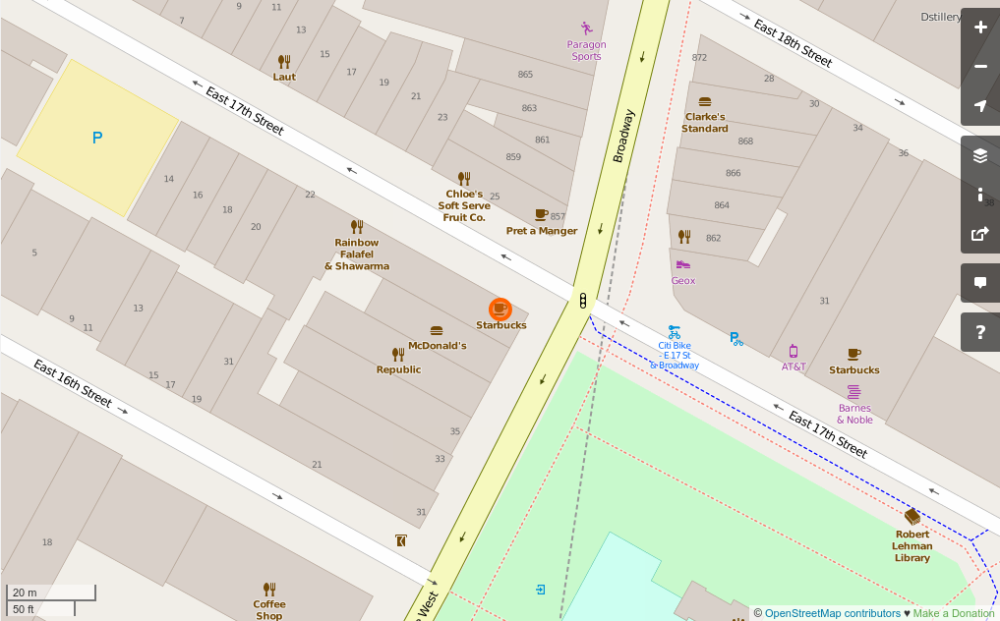

# A python based Apllication for finding nearest available business faciltiy like cafe , restaurant , hospital etc from a given node.

## It also searches for farthest available business facility .

### Queries are to made in the following ways :
**python osmpalnodesgraph.py nearest_node_tagged 246512355 cafe** 
>>It will then return the cafe nearest to node number 246512355, which is a node in     Union Square in New York
**python osmpalnodesgraph.py nearest_node_tagged "870 broadway" cafe (Windows)**  

**python osmpalnodesgraph.py nearest_node_tagged $'870 broadway' cafe (Mac or Linux)** 
>>Prints and displays graphically the cafe that's nearest any point at 870 Broadway in New York uses street address and street name combination

**python osmpalnodesgraph.py farthest_node_tagged "10010, new york" cafe** 
>>Prints and displays graphically the cafe that's farthest away from any point at the 10010 zip code. Uses zip code/postal code and city combination.

**python osmpalnodesgraph.py nearest_node_tagged starbucks hospital**  

>>Prints the hospital that's nearest to a one word location such as Starbucks.

**python osmpalnodesgraph.py farthest_node_tagged kfc cafe**  

>>Prints and displays graphically the cafe that's farthest away from a one word location such as kfc. 

In your command line, IF YOU KNOW A NODE NUMBER TO PROCESS, use any of the following commands:

 >>**python osmpalnodesgraph.py nearest_node_tagged 246512355 cafe**  

>>>(Prints and displays graphically the cafe nearest to node 246512355 You can enter your own OpenStreetmap node number instead of 246512355. cafe can be replaced with another Openstreetmap amenity such as bar, restaurant, school, etc.)
>>**python osmpalnodesgraph.py farthest_node_tagged 246512355 cafe** 

>>>(Prints and displays graphically the cafe farthest to node 246512355 You can enter your own OpenStreetmap node number instead of 246512355. cafe can be replaced with another Openstreetmap amenity such as bar, restaurant, school, etc.) 

### **Requirements :  python2**

